# ChronCurrency 🩺📲
**Copilot for ulcerative colitis and other chronic-condition warriors**

> _Log in seconds, learn what works, community-powered insights for lasting remission._


---

## Why this project?
I have been living with Ulcerative Colitis for about 5 years and have had much difficulty properly dealing with flare ups: Times when a part of my body gets inflammed leading to me not being able to eat almost all the food I enjoy eating, frequent bowel movements, constant hospital visits, and major restrictions of activity on my day to day life. Living with a condition like UC means juggling meds, symptoms, diet tweaks, sleep hygiene and endless doctor updates. Most tracking apps leave patients doing the heavy lifting. **ChronCurrency flips that script:**

At its core, the app lets you capture every UC-related event—pain spikes, meds taken or skipped, meals, sleep—with a tap or a quick voice note. Your entries stay on-device, but an **anonymous, aggregated snapshot** feeds a growing crowd-data pool. As that pool deepens, an on-device model surfaces clear, motivational patterns—e.g., “75 % of people saw lower inflammation after adopting X diet.” Those peer-driven insights can nudge you toward lifestyle tweaks no single doctor could pinpoint from their limited case load, helping you dial in the everyday factors that push you closer to lasting remission.

---

## Key features (MVP scope)

| Feature | What I'll build | “Done” checklist |
|---------|---------------------------|------------------|
| **Tap / Speak to Log** | A timeline list with a **+** button, quick-tap presets, and a mic; dictation turns into a new row. | • Logging takes < 3 s 5× in a row.<br>• Entries survive app relaunch. |
| **Adaptive Red-Flag Detection** | On-device model learns each person’s baseline **and** current meds; sets personalised thresholds (e.g., blood-in-stool for steroid users, stool-frequency jump for mesalamine users). | • After 7 days of sample data the app flags a simulated flare for User A but **not** for User B with different meds.<br>• False-positive rate stays < 5 %. |
 **Contextual Early-Warning Ping** | When personalised red flags pile up **or** predicted-flare probability > X %, push a tailored prompt: “Heads-up—your pattern looks like early flare. Want tips?” | • You can fake missed doses + symptom spike and receive a custom alert within a minute.<br>• Alert links to a short Q&A card that asks for extra context (sleep, stress). |
| **One-page PDF Export** | Button that prints last 30 days: summary chart + table. | AirDrop PDF looks clean on Mac Preview and prints on one sheet. |
| **Send to Doctor** | Share-sheet action that posts the PDF into the MyChart sandbox. | The document appears in your Epic test inbox. |
| **Community-driven Insights & Treatment Explorer (consent-based)** | App blends anonymised crowd data **and** UC literature to surface concrete, evidence-backed actions whenever (a) your pattern resembles an early-flare profile **or** (b) you’re still symptomatic after good med adherence. Suggestions can include trying a new medication, diet tweak, or stress-reduction strategy—each with a one-line citation and a “discuss with GI” prompt. | • Tailored card appears at the right moment with brief literature citation.<br>• After 2 weeks of persistent symptoms, a “consider budesonide foam”-type nudge shows up (if crowd+literature support it).<br>• Turning data-sharing consent off stops your logs from contributing, but you still receive advice. |
| **Autonomous adaptive PUCAI** | Extra fields based upon what patients report as symptoms that aren't already on PUCAI(Bowel Movement Urgency, Diet,Sleep,anything else) -> The app will automatically do a PUCAI test on you based on anything you've reported for that day(elminates need to manually fill out crude inaccurate existing PUCAI that patients simply don't care about) | Adaptive PUCAI evolving based on community insights | Many people report same symptom -> Consider adding to PUCAI |


## 🛣️ Roadmap

| Phase | What I'll build | Success check |
|-------|---------------------------|---------------|
| **1 · Bare-bones UI** | *Day 0–2* — Create an iOS app that opens to a timeline list and lets you add a manual symptom entry. | You can tap “+”, type “abdominal pain”, hit Save, and see it in the list after a relaunch. |
| **2 · Friction-free capture** | *Week 1* — Add one-tap buttons, voice dictation, and photo/scan stubs so logging takes < 3 seconds. | You can record a symptom hands-free while standing in line and it appears in the timeline. |
| **3 · Trend viewer** | *Week 2* — Show 24 h, 7-day, and 30-day charts that highlight spikes or med misses. | The app flags “symptom spike” when today’s pain > 2× personal baseline. |
| **4 · Early-warning AI** | *Week 3–4* — Train a simple model (start with rules, graduate to small ML) on your own + Reddit UC logs to predict likely flares 12–24 h ahead. | You get a push that says “👀 You often flare after 3 missed doses — you just missed 2.” |
| **5 · Doctor packet** | *Week 5* — One-tap PDF export that puts the last month’s key stats + chart on page 1, raw table on page 2. | You can AirDrop the PDF to yourself and it prints cleanly on one sheet. |
| **6 · MyChart messaging** | *Week 6–7* — Use the Epic/MyChart sandbox to send that PDF (or FHIR message) straight into the patient portal. | Your GI sees your test message in their Epic inbox without you emailing. |
| **7 · Cohort insights (opt-in)** | *Later* — Let users anonymously contribute stats so the app can say “90 % of peers saw pain drop after X.” | You can toggle a switch, upload a de-identified count, and immediately see comparative charts. |


---

## High-level architecture

```mermaid
   graph TD
    %% ────────── DEVICE ──────────
    subgraph Device
        Input["Voice / Tap / Camera"] --> Vault["Local&nbsp;Vault"]
        Vault --> Engine["Trend + Suggestion&nbsp;Engine"]
        Engine --> PDF["Doctor&nbsp;Packet&nbsp;PDF"]
        PDF --> Doctor["MyChart / Email"]
    end

    %% ────────── CLOUD (CONSENT-BASED) ──────────
    subgraph Cloud&nbsp;(consent-based)
        Anon["Aggregated&nbsp;Anonymised&nbsp;Data"]
        Research["UC&nbsp;Research&nbsp;Corpus"]
        Insight["Community&nbsp;Insight&nbsp;Service"]
    end

    %% ────────── DATA FLOWS ──────────
    Vault -- "anonymised metrics (opt-in)" --> Anon
    Anon --> Insight
    Research --> Insight
    Insight -- "pattern updates" --> Engine

```
---

## 🧭 User flow

```mermaid
graph TD
    %% ─────── USER FLOW ───────
    Input["Tap / Voice / Camera"] --> Vault["Local Vault"]
    Vault --> Engine["Trend + Suggestion Engine"]
    Engine -- "Alert / Tip" --> Notify["In-app Prompt"]

    %% Doctor packet path
    Engine --> Packet["Doctor Packet Builder"]
    Packet -- "PDF or FHIR" --> Portal["MyChart / Email"]

    %% Community insight loop (consent-based)
    Vault -- "anonymised metrics (opt-in)" --> Anon["Aggregated Data"]
    Anon --> Insight["Community + Research Insights"]
    Insight --> Engine

```



### Tech Stack 
```mermaid
%% Tech-stack overview
graph TD
    %% ──────────── iOS / DEVICE ────────────
    subgraph iOS&nbsp;Device
        UI["SwiftUI<br/>(iOS app)"]
        Persistence["SwiftData + SQLCipher"]
        AI["Core ML / MLC<br/>On-device models"]
        Alerts["Combine + async/await<br/>Background tasks"]
        PDF["PDFKit"]
        Telemetry["Sentry SDK"]
    end

    UI --> Persistence
    UI --> AI
    Persistence --> AI
    AI --> Alerts
    Alerts --> PDF
    UI --> PDF
    Telemetry --> SentryCloud

    %% ──────────── CLOUD / BACK END ────────────
    subgraph Cloud&nbsp;(AWS serverless)
        DoctorBridge["FastAPI Lambda<br/>FHIR / MyChart bridge"]
        AggregatorAPI["FastAPI Lambda<br/>Crowd aggregator"]
        Dynamo["DynamoDB"]
        Insights["Community + Literature<br/>Insight service"]
        SentryCloud["Sentry Cloud"]
    end

    PDF --> DoctorBridge
    AggregatorAPI --> Dynamo
    Dynamo --> Insights
    Insights --> DoctorBridge            %% for evidence links
    Persistence -- "anonymised metrics" --> AggregatorAPI

    %% ──────────── TRAINING PIPELINE ────────────
    subgraph Model&nbsp;Training
        Scraper["Reddit + PubMed<br/>Data pipeline"]
        Train["PyTorch Lightning<br/>Training"]
        Convert["coremltools<br/>Export → Core ML"]
    end

    Scraper --> Train
    Train --> Convert
    Convert --> AI

    %% ──────────── WEB DASHBOARD ────────────
    subgraph Web&nbsp;Dashboard
        WebApp["Next.js 14 + tRPC<br/>(Read-only charts)"]
    end

    WebApp --> Insights

    %% ──────────── CI / CD ────────────
    subgraph CI&nbsp;/ CD
        GH["GitHub Actions"]
        Fastlane["Fastlane<br/>(iOS builds)"]
        SLF["Serverless Framework<br/>(Lambda deploy)"]
        TestFlight["TestFlight"]
    end

    GH --> Fastlane
    GH --> SLF
    Fastlane --> TestFlight
    SLF --> DoctorBridge
    SLF --> AggregatorAPI
```
---

## Other Stuff

1. **Star** the repo to follow progress.   
2. **Join the chat** – Discord link coming with the first release.  


