# ChronCurrency 🩺📲
**Edge-first copilot for ulcerative colitis and other chronic-condition warriors**

> _Track once, forget forever – and keep every byte on your own device._

---

## Why this project?
Living with a condition like UC means juggling meds, symptoms, diet tweaks, sleep hygiene and endless doctor updates. Most tracking apps are cloud-first, clunky, and still leave patients doing the heavy lifting. **ChronCurrency flips that script:**

* **Local AI, zero stigma** – All analysis runs on your phone or laptop, so no personal-health info leaves the device unless you say so.  
* **One-tap logging** – Voice, quick-emoji tap, or camera barcode scan in under three seconds. No more spreadsheet guilt.  
* **Doctor-ready briefs** – Clear trend lines and bullet-point summaries you can export as encrypted PDF / FHIR and drop straight into the visit.  
* **Actionable nudges** – Only the reminders that matter (“pack Budesonide before 8 AM class”). Silence the rest.  

---

## Key features (MVP scope)

| Category | What it does | Why it matters |
| -------- | ------------ | -------------- |
| **Logging** | Voice dictation, lock-screen widgets, pill-bottle OCR | Removes friction so you actually log every event |
| **Local AI** | Quantised 7-B LLM spots flare triggers, missed doses, sleep correlation | Fast, works offline, private |
| **Insight layer** | Daily and 30-day dashboards, deviation alerts | Doctors get signal not noise |
| **Exports** | FHIR JSON and PDF with charts | Drop-in for any EMR |
| **Privacy guardrails** | On-device encryption, zero analytics by default | HIPAA-friendly foundation |

---

## Roadmap

| Phase | Goal | Milestones |
| ----- | ---- | ---------- |
| **0 – Bootstrap** | Public repo skeleton | README, Contributing, MIT License |
| **1 – Local CLI** | Proven data model + basic stats | Rust or Python CLI, unit tests, CSV / JSON store |
| **2 – Edge AI** | On-device trigger detection | Llama-2-7B-Q4 quant run, CrewAI wrapper, benchmark battery draw |
| **3 – Mobile Alpha** | iOS + Android prototype | React Native UI, secure storage, local notifications |
| **4 – Pilot Study** | Real-world feedback | 10 UC patients, one GI clinic, iterate on UX |
| **5 – Ecosystem** | Integrations + research | Apple Health sync, FHIR bridge, academic poster |

---

## High-level architecture

```mermaid
graph TD
  subgraph Device
    Input["Voice • Text • Photo • Sensor"]
    Core["ChronCurrency Core\n(Rust / Python)"]
    Model["Edge LLM\nQuantised 7-B"]
    Vault["Encrypted Vault"]
    Export["PDF & FHIR Export"]
  end

  Input --> Core
  Core  --> Model
  Model --> Core
  Core  --> Vault
  Core  --> Export
```

---

## Implementation plan (current status: **ideation 🧠**)

- [ ] **Performance spike** – Compare vLLM vs. llamafile on M-series.  
- [ ] **Schema draft** – Symptoms, meds, meals, notes, vitals.  
- [ ] **CLI prototype** – CRUD commands with pytest coverage.  
- [ ] **Inference POC** – Detect missed doses from synthetic logs.  
- [ ] **iOS MVP** – Swift + Core ML wrapper for quantised 7-B model; local-notifications.  
- [ ] **Web dashboard (later)** – Next.js + tRPC reading from encrypted export files.  
- [ ] **Mobile wireframes** – Low-fi Figma screens.  

---

---

## Contributing

1. **Star** the repo to follow progress.  
2. **Open an issue** labelled `idea` or `bug`.  
3. **Fork & PR** – follow conventional-commit prefixes (`feat:`, `fix:`, `docs:`).  
4. **Join the chat** – Discord link coming with the first release.  

---

## License

Released under the [MIT License](LICENSE). You own your contributions; we credit every contributor.

---

## Repo-name candidates

`chroncurrency` | `uc-edge-agent` | `symptom-pilot`

*Pick one when you create the Git repo – the README works with any slug.*
