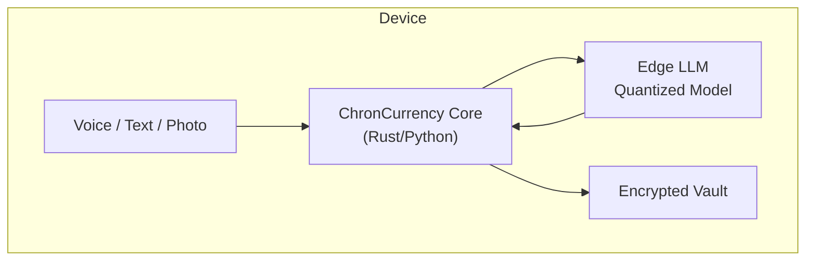

# Chroncurrency 🩺📲  
**Edge-first symptom & medication copilot for UC and other chronic-illness warriors**

> *“Track once, forget forever.”*  
> A privacy-preserving, on-device agent that slashes the daily admin of living with chronic conditions.

---

## 🌟 Vision

1. **Zero-friction logging** – voice, photo, or quick-tap entries recorded **offline** in < 3 seconds.  
2. **Smart insights** – edge-LLM surfaces flare triggers and missed meds *without* cloud latency or sharing PHI.  
3. **Actionable nudges** – reminders come *only* when they matter (e.g., “pack Budesonide before 8 AM class”).  
4. **Plug-and-play privacy** – all data lives on your phone / laptop; export is opt-in and end-to-end encrypted.  

---

## 🛣️ Roadmap (high-level)

| Phase | Goal | Key Deliverables |
|-------|------|------------------|
| **0 – Bootstrap** | Public repo & community scaffolding | This README · CONTRIBUTING.md · MIT LICENSE |
| **1 – MVP CLI** | Local CSV/JSON logger + basic stats | Rust/Python CLI · simple charts · unit tests |
| **2 – Edge AI** | On-device LLM trigger detection | Llama 2-7B quantized · CrewAI plugin wrapper |
| **3 – Mobile App** | iOS & Android UI (+ watchOS later) | React Native UI · secure storage · local notifications |
| **4 – Ecosystem** | Integrations & research collabs | Apple Health export · FHIR bridge · academic paper |

---

## 🏗️ Planned Architecture

## 🔧 Implementation Plan (current status: **ideation 🧠**)

- [ ] **Tech spike** — benchmark vLLM vs. llamafile on Mac M-series.  
- [ ] **Data model draft** — schema for symptoms, meds, meals, notes.  
- [ ] **CLI prototype** — CRUD commands with local tests (pytest).  
- [ ] **Edge inference POC** — detect “missed dose” from synthetic logs.  
- [ ] **Mobile UI storyboard** — low-fidelity Figma screens.

---

## 🤝 Contributing

All help is welcome—even if you just file an issue describing your pain points.

1. **Star** the repo to follow progress.  
2. **Open an issue** tagged `idea` or `bug`.  
3. **Fork & PR** – follow our commit style (`feat:`, `fix:`, `docs:`).  
4. 📣 **Community call** every first Friday (Discord link coming soon).

---

## 📜 License

[MIT](LICENSE) – you own your contributions; we credit every contributor.

---

## 🗺️ Repo Name Ideas

* `chroncurrency`  (default)  
* `uc-edge-agent`  
* `symptompilot`

> **Pick one when you create the GitHub repo—README works with any slug.**

